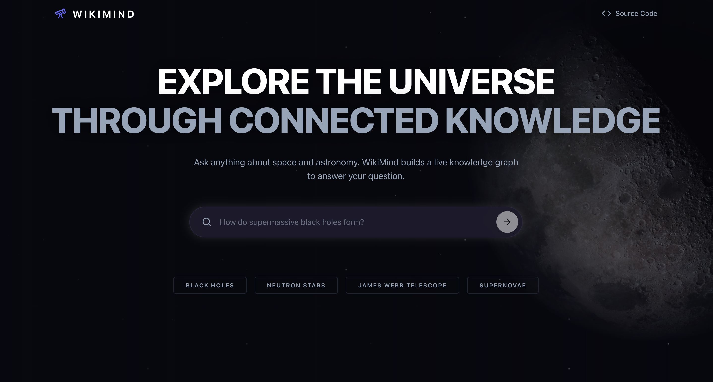
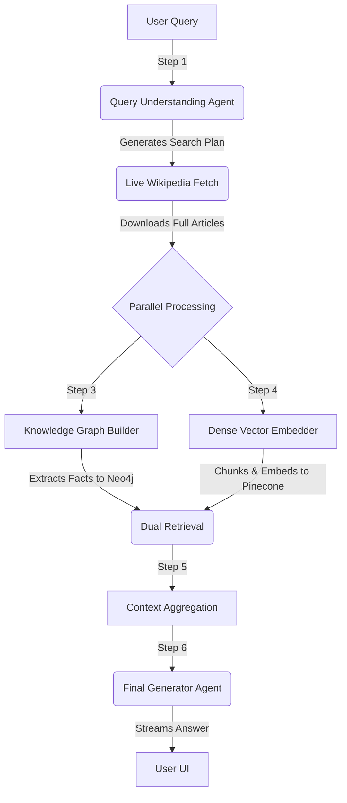
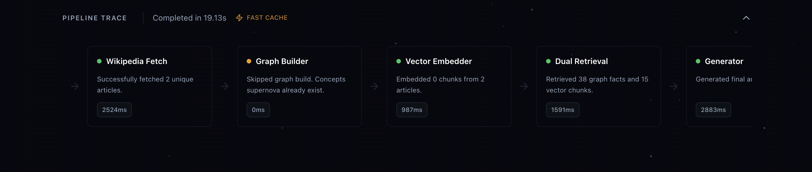
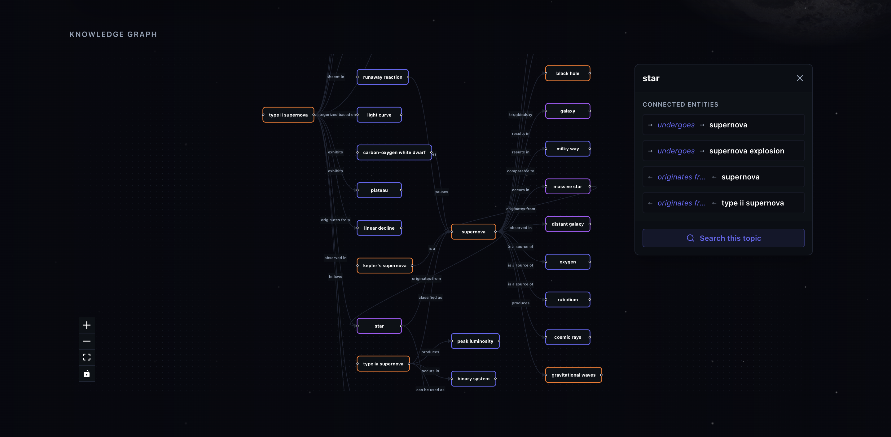
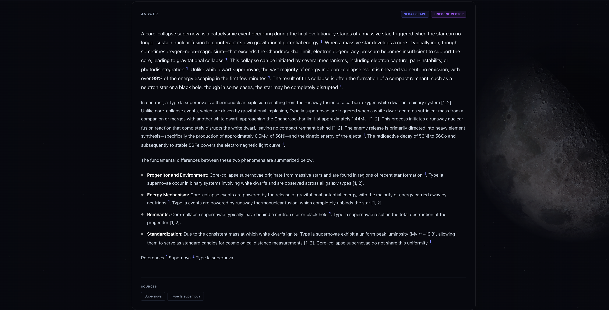

<div align="center">
  <h1>🧠 WikiMind</h1>
  <p><strong>A Next-Generation, Autonomous AI Research Engine</strong></p>
  
  [](https://python.org)
  [](https://fastapi.tiangolo.com)
  [](https://reactjs.org)
  [](https://python.langchain.com/docs/langgraph)
  [](https://opensource.org/licenses/MIT)
</div>


Traditional RAG (Retrieval-Augmented Generation) systems suffer from a fatal flaw: they rely exclusively on dense vector search, which retrieves disorganized chunks of text without understanding the factual, structural relationships between them. 

**WikiMind solves this.** 

WikiMind is an autonomous, agentic search engine that leverages a **Dual-Retrieval Architecture**. When you ask a question, a fleet of AI agents dynamically reads real-time Wikipedia data, builds a factual Knowledge Graph (Neo4j) on the fly, vectorizes the semantic meaning (Pinecone), and orchestrates the two together to synthesize a master-level answer.

---

## 🌟 Key Innovations

- **Dual-Retrieval RAG:** Merges the structural precision of a Knowledge Graph with the semantic fluidity of a Vector Database, solving hallucination and context-loss issues inherent in standard vector-only RAGs.
- **Agentic Orchestration:** Powered by LangGraph, the system utilizes a 6-step autonomous pipeline. AI agents write their own search queries, scrape data, and build graphs entirely on their own.
- **Real-Time Knowledge Ingestion:** WikiMind doesn't rely on stale, pre-trained data. It hits the live Wikipedia API during every query to ensure the most up-to-date facts are used.
- **Graceful Degradation:** Engineered for extreme fault-tolerance. If Neo4j or Pinecone experience an outage during the pipeline, the system automatically detects the failure and relies on the surviving database without crashing.
- **Interactive Streaming UI:** A breathtaking, dark-mode React frontend that streams the LLM tokens in real-time, while providing a live "pipeline trace" so you can watch the agents think and work.



---

## 🏗 The Autonomous Pipeline

Under the hood, every user query kicks off a massively parallel LangGraph workflow:





### 1. Query Understanding (Agent)
An LLM analyzes the raw user prompt to determine its intent, extracts core concepts, and autonomously writes optimal search queries to query Wikipedia.
### 2. Fetch
Executes highly concurrent Wikipedia API calls to download the full, raw text of the required articles.
### 3. Graph Builder (Agent)
A heavy-duty LLM parses the raw text and extracts precise mathematical/factual relationships (e.g., `(Supernova) -[creates]-> (Neutron Star)`) and injects them into **Neo4j**.
### 4. Vector Embedder
Simultaneously, the text is chunked and embedded into a high-dimensional vector space in **Pinecone** for semantic similarity search.
### 5. Retrieval
The system queries Neo4j via Cypher for factual relationships and Pinecone via cosine similarity for dense context, fusing them into a unified payload.


### 6. Generator (Agent)
A final LLM synthesizes the dual-context payload into a beautifully formatted, cited, and streaming response.



---

## 🛠 Tech Stack

WikiMind is built with a modern, scalable, and highly modular architecture.

| Layer | Technology | Purpose |
|-------|------------|---------|
| **Frontend** | React, Vite, Tailwind CSS, Framer Motion | High-performance, streaming user interface |
| **Backend** | Python, FastAPI, Uvicorn | Asynchronous, low-latency API server |
| **Orchestration** | LangGraph, LangChain | Multi-agent state management and routing |
| **AI / LLMs** | Google Gemini, OpenRouter (Nemotron) | Heavy-duty extraction and text synthesis |
| **Vector DB** | Pinecone | Semantic similarity and dense chunk retrieval |
| **Graph DB** | Neo4j (AuraDB) | Cypher-queried factual relationships |
| **Deployment** | Docker Compose, Nginx, AWS EC2 | Production-ready containerization and reverse proxying |

---

## 🚀 Deployment & Installation

WikiMind is fully containerized for seamless deployment.

### 1. Environment Setup
Create a `.env` file at the root of the project:
```env
# Databases
NEO4J_URI=neo4j+s://<your-db-id>.databases.neo4j.io
NEO4J_USERNAME=neo4j
NEO4J_PASSWORD=your_password
PINECONE_API_KEY=your_pinecone_key

# LLM Providers
GEMINI_API_KEY=your_gemini_key
OPENROUTER_API_KEY=your_openrouter_key
OPENROUTER_BASE_URL=https://openrouter.ai/api/v1
```

### 2. Production Deployment (Docker)
Deploy to any cloud provider (AWS, GCP, DigitalOcean) with a single command. Nginx handles reverse proxying automatically.
```bash
docker compose up -d --build
```
*(Note: Due to the extreme memory requirements of LLM Graph Extraction, servers with <2GB RAM must configure a swap file to prevent OOM termination).*

### 3. Local Development
**Backend:**
```bash
cd backend
python3 -m venv venv
source venv/bin/activate
pip install -r requirements.txt
python main.py
```

**Frontend:**
```bash
cd frontend
npm install
npm run dev
```

